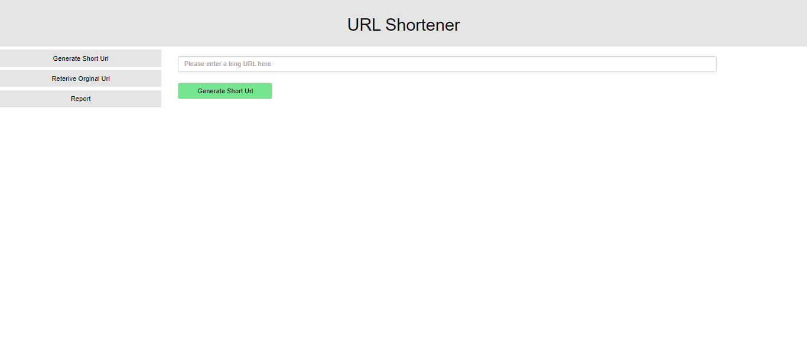

# Url Shortener

### Screenshots

---

### How to install ?

## Codeigniter 3 is used to develop the project

1. Install wamp/xampp server and configure it on your system

2. Download zip file, extract to htdocs in xampp, and to www in wamp

3. create database named 'shorten_db'

4. After creating the database, import 'shorten_db.sql'

5. The database backup file can be found in the unzipped folder.

6. make necessary changes application/config/config.php and application/config/database files (if applicable).

7. Rename project folder to 'url_shortener' (you can name it whatever you want).

8. By typing 'http://localhost/url_shortener/' into the address bar, the home page will load.
